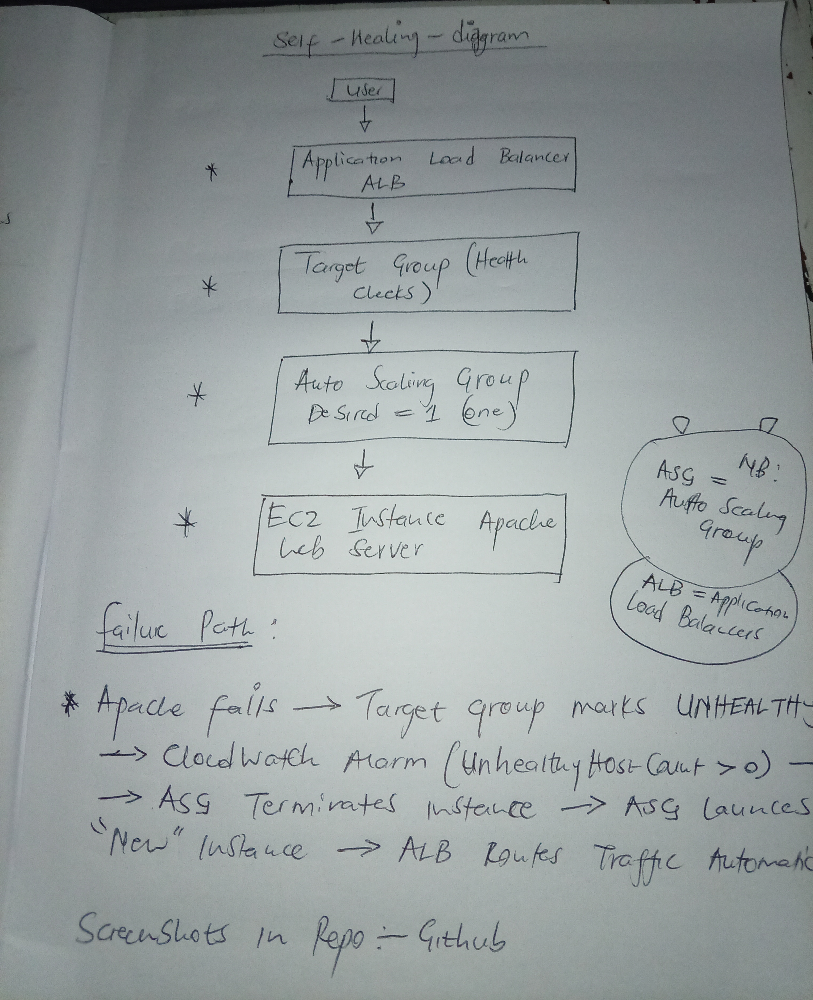
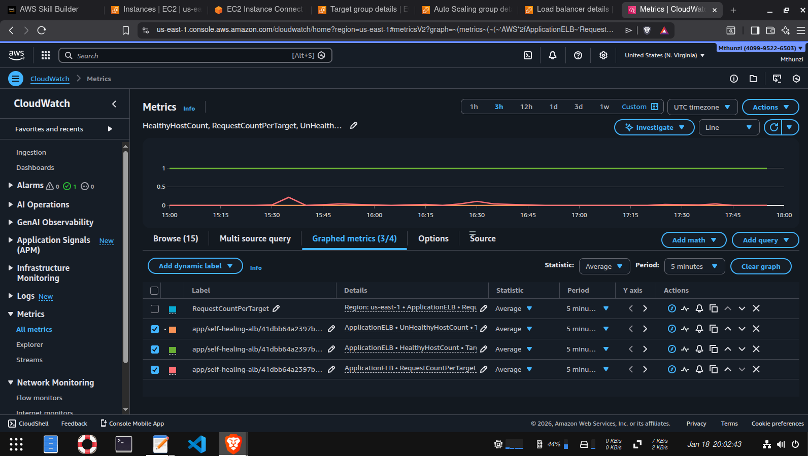
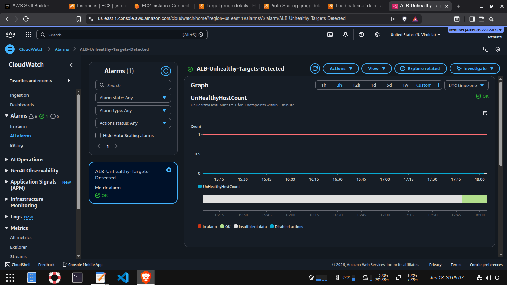
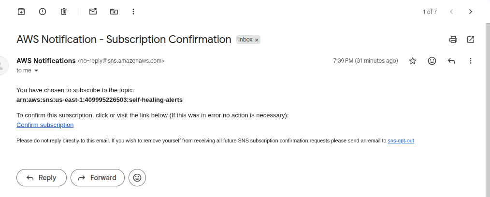
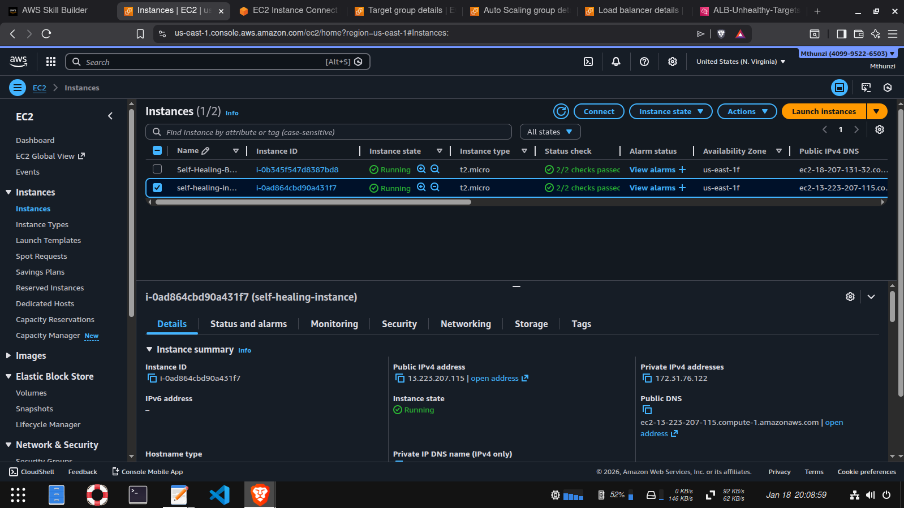
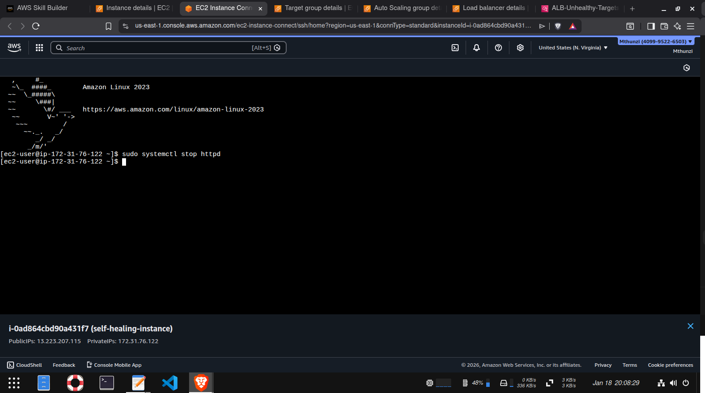

# Self-Healing Infrastructure on AWS

This project demonstrates how to design and operate **self-healing cloud infrastructure** using AWS core services.
When a failure occurs, the system automatically detects it, replaces the unhealthy component, and restores service without manual intervention.

---

## 🧠 Problem This Solves

In production environments, downtime costs money.
This project shows how to build systems that:
- Detect failures automatically
- Replace failed compute resources
- Restore traffic with minimal or zero downtime

---

## 🏗️ Architecture

**Core services used:**
- EC2
- Application Load Balancer (ALB)
- Auto Scaling Group (ASG)
- CloudWatch Metrics & Alarms
- SNS Notifications

---

## 🔁 How Self-Healing Works

1. Traffic is routed through an **Application Load Balancer**
2. EC2 instances run behind an **Auto Scaling Group**
3. ALB health checks monitor instance health
4. CloudWatch detects unhealthy targets
5. Auto Scaling terminates failed instances
6. A new instance is launched automatically
7. Traffic resumes without manual intervention

---

## 📊 Observability & Monitoring

### CloudWatch Metrics

### Alarm Configuration

### SNS Alerts

---

## 🧪 Failure Simulation Proof

Stopping the web server (`httpd`) caused:
- Target marked unhealthy
- Instance terminated
- New instance launched automatically

---

## 🔐 User Data Script

The EC2 instances bootstrap automatically using user data:

---

## 🎯 Key Takeaway

If a business needs **high availability and minimal downtime**,  
**EC2 + Load Balancer + Auto Scaling** is a foundational solution.

This project demonstrates **real production behavior**, not a tutorial clone.
